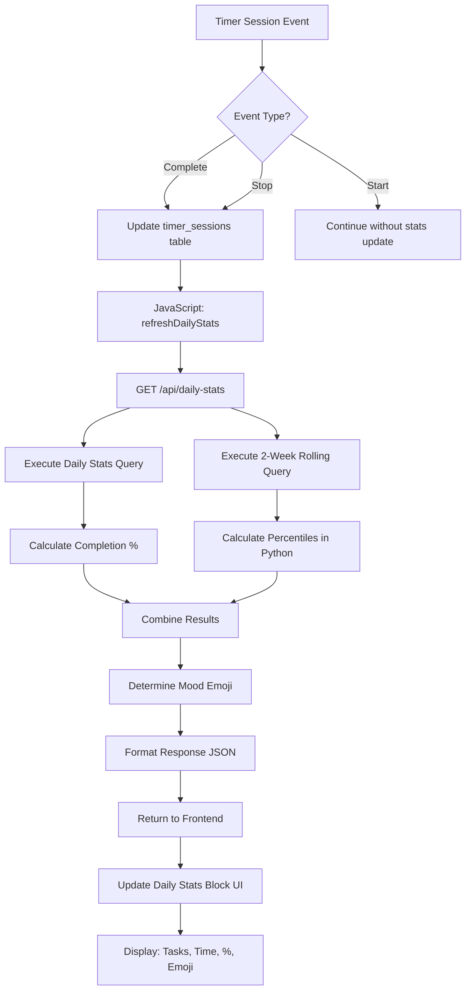

# Daily Statistics Implementation Workflow

## System Architecture Overview

## Implementation Flow

### Phase 1: Backend API Implementation
1. **Add daily-stats endpoint to [`app.py`](app/app.py:596)**
2. **Implement SQL query execution**
3. **Add percentile calculation logic**
4. **Add time formatting utilities**
5. **Handle edge cases and errors**

### Phase 2: Frontend HTML Structure
1. **Add statistics block HTML to [`countdown.html`](templates/countdown.html:554)**
2. **Position below timer controls**
3. **Create semantic structure for accessibility**

### Phase 3: Frontend Styling
1. **Add CSS styles to [`countdown.html`](templates/countdown.html:527)**
2. **Match existing app design language**
3. **Ensure responsive design**
4. **Add transition animations**

### Phase 4: JavaScript Integration
1. **Add stats fetching functions**
2. **Add DOM manipulation for updates**
3. **Integrate with existing timer events**
4. **Add error handling and fallbacks**

### Phase 5: Testing & Edge Cases
1. **Test with no data scenarios**
2. **Test with various time ranges**
3. **Verify emoji calculation logic**
4. **Test responsive design**

## File Changes Summary

### Modified Files:
- [`app/app.py`](app/app.py) - Add `/api/daily-stats` endpoint
- [`templates/countdown.html`](templates/countdown.html) - Add HTML, CSS, and JavaScript

### New Files Created:
- [`plans/daily_stats_queries.md`](plans/daily_stats_queries.md) ✓ 
- [`plans/daily_stats_design.md`](plans/daily_stats_design.md) ✓
- [`plans/implementation_workflow.md`](plans/implementation_workflow.md) ✓

## Decision Points

### Emoji Calculation Strategy
Using simplified percentile approach:
- Get 14 days of data, sort by time spent
- 25th percentile = data[len(data)//4]
- 75th percentile = data[3*len(data)//4] 
- Compare today's total with percentiles

### Time Display Format
- < 60 seconds: "XXs"
- < 3600 seconds: "XXm"
- >= 3600 seconds: "Xh XXm"

### Refresh Triggers
- Page load
- Timer completion (successful)
- Timer stop (unsuccessful)
- Manual refresh (optional click handler)

## Performance Considerations
- Cache daily stats in JavaScript (5-minute expiry)
- Optimized SQL queries with proper indexing
- Minimal DOM updates (only changed values)
- Debounced refresh calls

## Error Handling Strategy
- Graceful degradation if API fails
- Default values for missing data
- User-friendly error messages
- Fallback to previous cached data