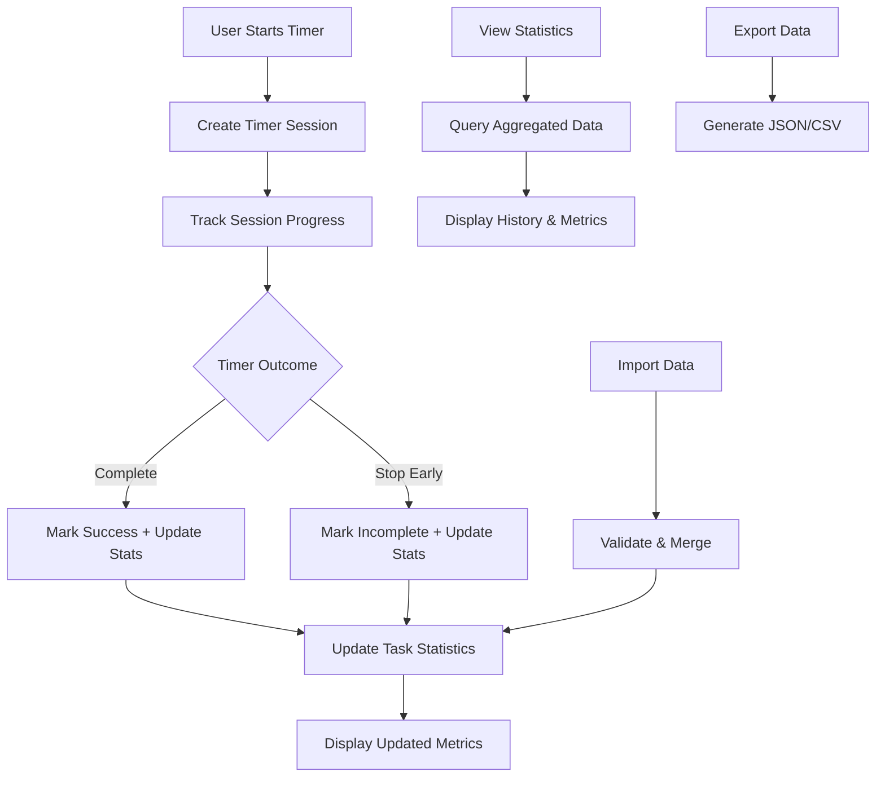

# Timer History Tracking Architecture

## Overview
Enhance the Smart Wish Tracker with comprehensive timer history tracking that monitors task performance, completion rates, and time spent on each task.

## Requirements Analysis
1. **Store task name** - Track which task was being worked on
2. **Where it was created** - Timestamp and session identifier
3. **Successful runs count** - Number of completed timer sessions
4. **Total attempts** - All timer starts (successful + unsuccessful)
5. **Total time spent** - Including time from unsuccessful runs

## Current System Analysis

### Timer Integration Points
- `startTimer()` - Session begins, track attempt
- `pauseTimer()` - Optional: track pause duration
- `stopTimer()` - Session ends unsuccessfully
- `timerComplete()` - Session ends successfully
- Task creation - Track creation source and location

### Current Timer Variables
- `currentTask` - Active task name
- `totalSeconds` - Current timer value
- `DEFAULT_SECONDS` - Standard timer duration (1500 = 25 min)
- `isRunning`, `isPaused` - Timer state

## Database Schema Design

### New Tables

#### timer_sessions
```sql
CREATE TABLE timer_sessions (
    id INTEGER PRIMARY KEY AUTOINCREMENT,
    task_name TEXT NOT NULL,
    session_id TEXT NOT NULL,          -- Browser session identifier
    started_at TIMESTAMP DEFAULT CURRENT_TIMESTAMP,
    ended_at TIMESTAMP,                -- NULL if session still active
    planned_duration INTEGER NOT NULL, -- Seconds planned for this session
    actual_duration INTEGER,           -- Seconds actually spent (NULL if incomplete)
    status TEXT NOT NULL,              -- 'completed', 'stopped', 'active'
    creation_source TEXT,              -- 'timer_center', 'task_slot', 'manual'
    created_at TIMESTAMP DEFAULT CURRENT_TIMESTAMP
);
```

#### task_statistics (derived/aggregated data)
```sql
CREATE TABLE task_statistics (
    id INTEGER PRIMARY KEY AUTOINCREMENT,
    task_name TEXT NOT NULL UNIQUE,
    first_created TIMESTAMP,
    total_attempts INTEGER DEFAULT 0,
    successful_runs INTEGER DEFAULT 0,
    total_seconds_planned INTEGER DEFAULT 0,
    total_seconds_spent INTEGER DEFAULT 0,
    last_session TIMESTAMP,
    updated_at TIMESTAMP DEFAULT CURRENT_TIMESTAMP
);
```

## API Endpoints Design

### Timer Session Management
- `POST /api/timer/start` - Start new timer session
- `PUT /api/timer/pause` - Pause current session
- `PUT /api/timer/resume` - Resume paused session  
- `PUT /api/timer/stop` - Stop session (unsuccessful)
- `PUT /api/timer/complete` - Complete session (successful)

### History & Statistics
- `GET /api/timer/history?task=name` - Get session history for task
- `GET /api/timer/stats?task=name` - Get aggregated statistics
- `GET /api/timer/stats` - Get all task statistics
- `DELETE /api/timer/cleanup?days=30` - Clean old history data

### Data Export
- `GET /api/timer/export?format=json` - Export history data
- `POST /api/timer/import` - Import history data

## Frontend Architecture

### Session Tracking System
```javascript
class TimerSession {
    constructor(taskName, sessionId, creationSource) {
        this.sessionId = sessionId;
        this.taskName = taskName;
        this.startTime = null;
        this.endTime = null;
        this.plannedDuration = null;
        this.actualDuration = null;
        this.creationSource = creationSource;
        this.status = 'inactive';
    }
    
    async start(plannedSeconds) { /* ... */ }
    async pause() { /* ... */ }
    async stop() { /* ... */ }  
    async complete() { /* ... */ }
}

// Session ID generation
function generateSessionId() {
    return `${Date.now()}-${Math.random().toString(36).substr(2, 9)}`;
}
```

### Statistics Display Component
```javascript
class TaskStatistics {
    constructor(taskName) {
        this.taskName = taskName;
        this.stats = null;
    }
    
    async loadStats() { /* ... */ }
    renderStatsCard() { /* ... */ }
    renderHistoryList() { /* ... */ }
}
```

## UI Design Integration

### Task Slot Enhancement
Each task slot will display:
- Task name
- Success rate (✅ 12/15 sessions)
- Total time spent (⏱️ 6h 25m)
- Action buttons: 🏃 Run | ✏️ Edit | 📊 Stats | 🗑️ Delete

### New Statistics Panel
Toggle-able panel showing:
- **Overall Statistics**
  - Total sessions: 45
  - Success rate: 73% (33/45)
  - Total focused time: 18h 45m
  
- **Per-Task Statistics**
  - Task list with individual metrics
  - Click to view detailed history
  
- **Recent History**
  - Last 10 sessions with outcomes
  - Time spent per session

### History Detail Modal
For each task, show:
- Session timeline graph
- Success/failure markers
- Time spent per attempt
- Average session duration
- Best/worst streaks

## Implementation Flow

### 1. Database Setup
- Add new tables to `init_db()`
- Create migration for existing installations
- Add indexes for performance

### 2. Backend API Implementation
- Session management endpoints
- Statistics aggregation functions
- History querying with pagination
- Data cleanup utilities

### 3. Frontend Session Tracking
- Integrate `TimerSession` class
- Enhance existing timer functions
- Add session ID generation
- Implement automatic session cleanup

### 4. Statistics UI Components
- Task statistics display
- History viewing modal
- Export/import functionality
- Data management tools

### 5. Integration with Existing Features
- Enhance task slots with statistics
- Add history access to timer center
- Update autocomplete with usage frequency
- Add statistics-based task suggestions

## Data Flow Diagram



## Performance Considerations

### Database Optimization
- Index on `task_name` and `session_id` for fast lookups
- Automatic cleanup of sessions older than 6 months
- Batch statistics updates to avoid frequent recalculation

### Frontend Optimization
- Cache statistics data for 5 minutes
- Lazy load detailed history on demand  
- Debounce statistics updates during active sessions

### Storage Management
- Implement data retention policies
- Compress old session data
- Optional cloud backup integration

## Security & Privacy
- All data stored locally (no external services)
- Session IDs are not personally identifiable
- Optional data export for user control
- Clear data deletion capabilities

## Future Enhancements
- Task difficulty scoring based on success rates
- Smart break reminders based on patterns
- Achievement system for streaks and milestones
- Time tracking analytics and insights
- Integration with calendar systems
- Team collaboration features